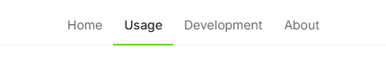

# Page Header

Here are a few unrelated customizations to Zensical's page header.

## Setup

First, ensure the[`extra_css`][extra_css] configuration option is set and
points to a css file. For example:

[extra_css]: https://zensical.org/docs/customization/#additional-css

=== "`zensical.toml`"

    ``` toml
    [project]
    extra_css = ["assets/stylesheets/extra.css"]
    ```

=== "`mkdocs.yml`"

    ``` yaml
    extra_css:
        - assets/stylesheets/extra.css
    ```

## Highlight Active Tab with Color

When [navigation tabs] are enabled, by default, Zensical will highlight the
active navigation tab with a thick light grey bar. If you would like a pop of
color, add the following to `extra.css`, which uses the [accent color].

[navigation tabs]: https://zensical.org/docs/setup/navigation/#navigation-tabs
[accent color]: https://zensical.org/docs/setup/colors/#accent-color

``` css
/* Highlight the bottom border of the active nav item. */
.md-tabs .md-tabs__item--active {
    border-bottom: .1rem solid var(--md-accent-fg-color);
}
```

If the accent color is `green`, the result may look like this.



## Right-Align Search When No Repository

When you have no [repository] associated with your Zensical site, the search
bar on the page header does not automatically move over to the right of the
page and leaves a blank area where the repository information would normally
be. To force the search bar to align to the far right, add the following to
`extra.css`.

[repository]: https://zensical.org/docs/setup/repository/

``` css
/* Move search to far right */
.md-header__source {
    display: none;
}
```

!!! Warning

    Be careful with this one. While it does accomplish the desired result, it
    removes (hides) the repository block from the page. Therefore, even if
    the repository configuration options are later set up, the information
    will not show until the CSS rule is removed.
