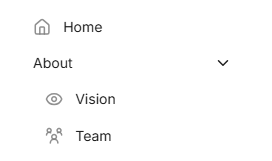
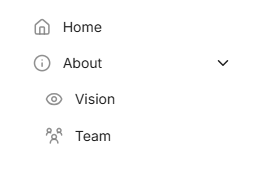

Out-of-the-box, Zensical provides for [custom icons][page icon] to be defined
for each page in the frontmatter for that page. When an icon is defined,
that icon will be shown in the main site navigation for that page.  Index
pages likewise define a custom icon for the containing section. However, when
a section does not have an index page, Zensical does not provide a mechanism
for defining an icon.

[page icon]: https://zensical.org/docs/authoring/frontmatter/#page-icon

Consider the following navigation:

=== "`zensical.toml`"

    ``` toml
    [project]
    nav = [
      { "Home" = "index.md" },
      { "About" = [
        "about/vision.md",
        "about/team.md",
      ] },
    ]
    ```

=== "`mkdocs.yml`"

    ``` yaml
    nav:
      - Home: index.md
      - About:
        - about/vision.md
        - about/team.md
    ```

Assuming every page has a page icon defined, the navigation might look like this.



We could add an index page at `about/index.md` and define a custom icon for
that page, which would then be associated with the `About` section. However,
we don't have any content for that page and would rather not have an index
page.

## Custom Template

As a workaround, we can modify the navigation template to pull in a value
defined in the extra configuration option.

First, configure a [theme override directory][theme overrides].

[theme overrides]: https://zensical.org/docs/customization/#configuring-overrides

=== "`zensical.toml`"

    ``` toml
    [project.theme]
    custom_dir = "overrides"
    ```

=== "`mkdocs.yml`"

    ``` yaml
    theme:
      custom_dir: overrides
    ```

Then, copy the contents of <https://github.com/zensical/ui/blob/master/src/partials/nav-item.html>
to `overrides/partials/nav-item.html`. From now on, when building your site,
this local file will be used rather than the default provided with the theme.
Therefore, any customizations to this file will be applied as well.

Edit the local file at `overrides/partials/nav-item.html` as follows

``` diff {linenums="54"}
   <!-- Navigation link icon -->
   
     
+  
+    
   
```

Specifically, add the 2 lines which start with a `+` (do not include the `+`)
at the indicated location.

!!! warning

    This recipe has been tested with Zensical version 0.0.65 and the default
    theme files could be different in future versions of Zensical. The edits
    above may need to be adjusted accordingly.

    Conversely, the theme files could be altered in a future version of Zensical
    and you will not get those future updates so long as you do not update
    your local copy of `partials/nav-item.html`.

## Extra Configuration Option

Then in the `zensical.toml` configuration file add the following for each
section that you want to define an icon.

=== "`zensical.toml`"
    ```
    [project.extra.section_icons]
    "About" = "lucide/info"
    "Other" = "lucide/ice-cream-cone"
    ```

=== "`mkdocs.yml`"

    ``` yaml
    extra:
      section_icons:
        About: lucide/info
        Other: lucide/ice-cream-cone
    ```

The above configuration defines icons for two sections: `About` and `Other`.
So long as the section title here is an exact match to the title as defined
in the navigation, then the specified icon will get attached to that section
in the navigation. Be sure to specify icons that actually exist (see the
list of [included icon sets]).

[included icon sets]: https://zensical.org/docs/authoring/icons-emojis/#included-icon-sets

## The Result

In our example navigation, the `About` section now has an icon.


